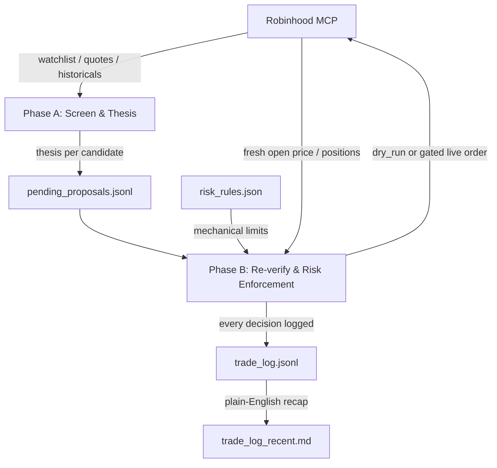

# FriesTrader


An AI trading agent built to run cheap and fully on its own, trading real
orders on [Robinhood](https://robinhood.com) using its
[Agentic Trading MCP server](https://robinhood.com/us/en/agentic-trading/).
Once set up, it runs unattended on its own schedule every weekday, no
manual triggering needed. Two short scheduled Claude Code sessions a day
screen stocks, write out their reasoning, and (only under a narrow,
explicit gate) place real trades, without a team of specialized
sub-agents burning tokens on every decision. The actual safety mechanism
is mechanical, auditable risk rules, not the model's judgment, and
because it's just two lean sessions instead of a multi-agent pipeline, it
runs comfortably on a Claude Pro subscription (as low as $200/year on the
annual plan), no Claude Max or metered API spend required.

This is a template/framework extracted from a real, live deployment.
Adapt it, don't just run it blind — read "What this does and doesn't
solve" below before pointing it at real money.

## Requirements

- A [Robinhood](https://robinhood.com) account with
  [Agentic Trading](https://robinhood.com/us/en/agentic-trading/) enabled,
  connected via Robinhood's own MCP server.
- [Claude Code](https://claude.com/claude-code), on a Pro subscription or
  higher.

## How it works

Trading runs as **two separate phases, on two separate schedules** — a
full trading day's closing data feeds the thesis, and a fresh opening
price is used for the actual order, rather than trading on a stale
overnight price.



- **Phase A** (Steps 1–3, ~4:30pm Central weekdays) — screens candidates,
  gathers signals, writes a logged thesis per candidate to
  `pending_proposals.jsonl`. Places no orders, not even dry-run ones.
  Full spec: `PHASE_A_TASK.md`.
- **Phase B** (Steps 4–7, ~8:35am Central weekdays) — re-verifies Phase A's
  proposals against fresh opening data, enforces `risk_rules.json`
  mechanically, and dry-runs or (gated) places orders. Full spec:
  `PHASE_B_TASK.md`.

Both are designed to run as cloud-hosted scheduled agent sessions,
independent of any local machine — each run clones this repo fresh and
commits/pushes its results back to `main`, so the repo itself is the
persistent state, not local disk.

## Running it

Two schedules need to fire: Phase A around 4:30pm Central on weekdays
(hand Claude Code `PHASE_A_TASK.md` to execute), and Phase B around
8:35am Central on weekdays, 5 minutes after market open (hand it
`PHASE_B_TASK.md`). Each run is a fresh Claude Code session pointed at
this repo — no state needs to persist locally between runs, since the
repo itself (`risk_rules.json`, `pending_proposals.jsonl`,
`trade_log.jsonl`) is what's read and written each time.

- **Recommended: Claude Code's own scheduled cloud routines.** Set one
  routine to run `PHASE_A_TASK.md` on the Phase A schedule and a second
  for `PHASE_B_TASK.md` on the Phase B schedule. This runs independent of
  any machine being on — the actual point of "fully automated."
- **Alternative: a local scheduler** (cron, Windows Task Scheduler, etc.)
  invoking the Claude Code CLI against this repo on the same two
  schedules. Works, but only while that machine is running, and you're
  responsible for keeping the repo synced (`git pull` before, `git push`
  after each run) since the repo — not local disk — is the source of
  truth. If you go this route, make sure only one scheduler is ever
  active for a given phase — two schedulers firing the same phase in the
  same cycle risks duplicate `risk_check`/`order` log entries, or
  duplicate real orders once `execution.mode` is `"live"`.

### Example cycle output

`trade_log_recent.md` is regenerated every Phase B run — a plain-English
recap for a quick mobile/GitHub read, no JSON-parsing required. A day
looks something like this (symbols genericized, not a real account):

> **2026-07-09**
>
> **Loss limit**: OK — daily 0.0%, weekly -2.1%, within -5%/-10% limits.
>
> **Held positions** (stop-loss / take-profit):
> - EXAMPLE — stop 7.00% (vol-scaled), drawdown -2.3% — holding
>
> **New-entry candidates considered**: OTHER, ANOTHER
> - OTHER — approved: medium conviction, $60.00 (12% of account)
> - ANOTHER — rejected: max_concurrent_positions already filled this cycle
>
> **Orders placed**: OTHER — buy $60.00 (dry_run)

## Files

- `risk_rules.json` — the hard, mechanical limits (position sizing, stop-
  loss, loss limits, universe filters, execution mode). Nothing in this
  system should be able to override these. Several fields need your own
  account details before this is usable — see First-time setup below.
- `PHASE_A_TASK.md` / `PHASE_B_TASK.md` — the full, self-contained spec
  each phase follows.
- `trade_log_template.jsonl` — the log line shapes; real logs should
  accumulate in a file like `trade_log.jsonl` in this same style.
  Phase B also regenerates `trade_log_recent.md` (full overwrite) — a
  plain-English recap of the latest day, for a quick mobile/GitHub read
  without parsing raw JSON — convenience view only, `trade_log.jsonl`
  is still the source of truth.

## Thesis record shape (Phase A, Step 3)

```json
{
  "symbol": "XXXX",
  "date": "YYYY-MM-DD",
  "thesis": "1-3 sentences on what changed and why it might matter",
  "conviction": "low | medium | high",
  "invalidation": "what would prove this thesis wrong",
  "direction": "long | avoid | exit_existing",
  "sources": ["Outlet Name: https://...", "..."]
}
```

- **No price targets** — no reliable basis for a specific number, and it
  invites false precision.
- **No forecasting language treated as fact** — "this suggests...", not
  "this will...".

## First-time setup

1. Fill in `account_number` in `risk_rules.json` with your own Robinhood
   account number, set `starting_capital_usd` to your real starting
   balance, set `universe.watchlist_name` to a watchlist you've already
   created and populated in your Robinhood account, and review every
   other threshold — the defaults here are illustrative, not a
   recommendation.
2. Fill in `wash_sale_avoidance.linked_accounts` with every Robinhood
   account number you personally control, not just this one — if this is
   genuinely the only account you trade in, a single-entry list (just
   this account's number) is enough. Leave `enabled: true` unless you
   specifically want buys never blocked on wash-sale grounds.
3. Keep `execution.mode` set to `"dry_run"`. Leave it there for at least
   the number of cycles set in `dry_run_min_cycles_before_live` — don't
   shortcut this.
4. After each cycle, read `trade_log.jsonl` yourself. Look specifically
   at rejected candidates and stop-loss triggers, not just the trades
   that "worked" — that's where you'll see if the reasoning step is
   actually sound or just getting lucky with an uptrend.
5. Only flip `execution.mode` to `"live"` yourself, by hand, after you've
   reviewed enough dry-run cycles to trust the output. Do not let the
   agent flip it for you as a shortcut.

## What this does and doesn't solve

- It gives you a structured, auditable version of "let an LLM screen and
  reason about trades" instead of an opaque one.
- It does **not** make LLM-driven stock picking more likely to beat a
  simple index fund — there's no established track record for that, and
  this can't backtest the reasoning step honestly (news-based reasoning
  can't be validated against historical data the model may already know
  the outcome of).
- The risk rules are the actual safety mechanism here, not the reasoning
  quality. Treat loosening them as the highest-risk change you can make
  to this system.
- This is a template extracted from a real deployment trading a small
  personal account, shared for others to learn from or adapt. It is
  genuinely not financial advice, and running it against real money is
  entirely your own decision and risk.

## License

MIT — see `LICENSE`. Provided as-is, with no warranty; see the license
for the full disclaimer.
